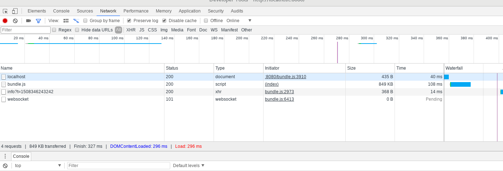

# 1: The life without HMR

## What we will cover: 
Before we learn HMR let's see what kind of problems it fixes by looking at the development experience without it.  

This lesson has very simple code that shows a simple bundling for JavaScript. It is a simple code that has the following:  

1. One JavaScript module that requires anther JS module, which in trun requires a third party library.  
2. webpack-dev-server with watch or hot modewebpack.

P.S: watch mode is not the same as `HMR`, and just continue to next section to see the difference.

## Technical Background:
Webpack provides `watch mode` feature, which runs a process that will watch any changes in your input codes, and rebundle them on the fly.  
And if you use Webpack-dev-server as your web developement server for your SPA (Single Page Application), then it watches and auto-reload your compile code, and refresh your browser just when you save your code, without you refreshing the browser.  
But this watching feature is different than Webpack-dev-server 's HMR, because auto-reloading will reload the whole application (HTML, JS, CSS) files all together , where HMR will modify only the changed part by replacing the code in memory.  
So, if the build process takes one minute, then every time you save your code, it will take a whole minute to do the whole build and reload the whole application again. Adding to that, if you are in the middle of testing, then all the testing steps are lost, and you are from the start of your application again.

## Going through the code:
***

#### index.js file:
---
The index file requires another file (print.js) and a third party library (lodash).

#### webpack.config.js
---
The entry point is 
```javascript
    entry: './src/index.js', // input file
    output: {
        filename: 'bundle.js',
        path: path.resolve(__dirname, 'dist') // output into folder: dist
    },
```
and we configure webpack-dev-server by simply specify the directory from where the webpack will server the web application:

```javascript
devServer: {
        contentBase: './dist'
    },
```
And webpack-dev-server will monitor all files associated with the entry point and rebuild and reload the whole bundle.

## Test it:
run 
```bash
npm install
# you don't need npm run build, becasue npm start will do it
npm start
```

Click on the button and whatch the output message in the console.  
Change the message in the file `print.js` and notice how the browser refresh by itself, and click on the button and see the new message.  

Notice on Chrome Developer tool's Network tab, that any time you change `print.js` the whole application will be downloaded with all pages.  



## Conclusion:

webpack-dev-server provides out-of-box watch mode for the whole application without any changes, or even configuration, but it will load the whole application again.