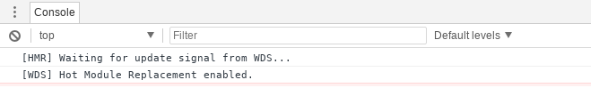
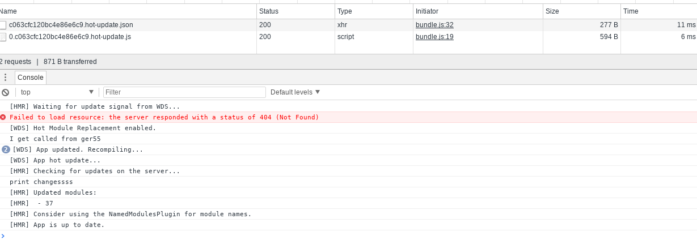

# Lesson 2:

## Off-the-shelf Webpack-dev-server's HMR

## Description: 
webpack-dev-server provides off-the-shelf HMR feature. All what we have to do is to add the option `hot` when we configure webpack-dev-server:  

1. Simple JS bundling of two files, and one third-party library.
2. webpack-dev-server as a server to show `HMR` feature.


The lesson describe the simplest usage of webpack to bundle a javascript file from two files (index.js and print.js), and webpack-dev-server to serve the result.

## How HMR or the Hot option works?
Webpack-dev-server at first run, will build the final bundle, and load the application in memory (P.S: it doesn't write to disk), and then monitor the input files and rebuild only the changes as they occur and replace the only code that changed in memory.  
It can do that because webpack split (internally) the final bundle into smaller chuncks.

### Going through the code:
***

#### webpack.config.js
Just add the option: `hot` into the server configuration:

```javascript
devServer: {
        contentBase: './dist',
        hot: true
    },
```
And webpack-dev-server will monitor all files associated with the entry point and rebuild and reload the whole bundle.

## Test it:
run 
```bash
npm install
# you don't need npm run build, becasue npm start will do it
npm start
```
Before you do any code change open chrome dev tools, and notice in the console the following:



You see now HMR is enabled in the screen above.  

Now, do a small change into the file `print.js`, and save.  
The moment you save you will see the follwoing in the Network tab in dev tools:




As you see the web browser didn't load the whole application, but just two small bundles (less than 600 bytes).
## Conclusion:

webpack-dev-server provides out-of-box HMR reloading for the application.