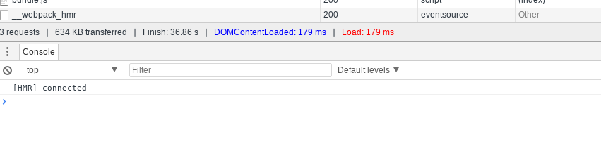
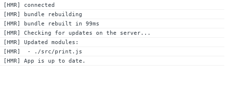

# Lesson 4:

## Using HMR for server and client in a full-stack application

## Description: 
after we found out how to use [webpack-dev-middleware](https://github.com/webpack/webpack-dev-middleware) in a node application, let us move on and see how to implement HMR in a full-stack application.  
In order to do that we use another middleware: [webpack-hot-middleware](https://github.com/glenjamin/webpack-hot-middleware).

Let us see how we can use that middleware.  


### Going through the code:
***

#### server.js
On the server side we add another middleware (webpack-hot-middleware) after the previous one (webpack-dev-middleware):


```javascript
const webpack = require('webpack');
const webpackDevMiddleware = require('webpack-dev-middleware');

const config = require('./webpack.config.js');
const compiler = webpack(config);

app.use(webpackDevMiddleware(compiler, { noInfo: true,
  publicPath: config.output.publicPath
}));
app.use(require('webpack-hot-middleware')(compiler));

```

#### webpack.config.js
in the webpack.config.js we add `HotModuleReplacementPlugin` like this:

```javascript
plugins: [
        new webpack.HotModuleReplacementPlugin()
    ]
```
`HotModuleReplacementPlugin` will tell webpack to provides hot updates to the server.  

And we add another entry point in the entry files:

```javascript
entry: [
        'webpack-hot-middleware/client',
        './src/index.js'
    ],
```

This is not enough. HMR are opt-in options, and each module has to support it should associate with the HMR engine using HMR API.

#### src/index.js

On the client code we add HMR API for the root module, so it will handle all its submodules, like this:

```javascript
  if (module.hot) {
    module.hot.accept('./print.js', function() {
      printMe = require('./print');
      
      document.body.removeChild(element);
      element = component(); // Re-render the "component" to update the click handler
      document.body.appendChild(element);
    });
  }

```

## Test it:
run 
```bash
npm install
# you don't need npm run build, becasue npm start will do it
npm run server
```
Before you do any code change open chrome dev tools, and notice in the console the following:



You see now HMR is enabled in the screen above.  

Now, do a small change into the file `print.js`, and save.  
The moment you save you will see the follwoing in the Network tab in dev tools:




And test the application by clicking on the button, and you will see the new message (without refreshing)
## Conclusion:

We can do HMR with full-stack application by adding two middlewares which will do the build for us, and hot reloading engine, and then hook it up by adding code to consume HMR using HMR API.  
But that means we have to always add that HMR API code. But wait...!.  
We will find how to avoid that with other libraries.

